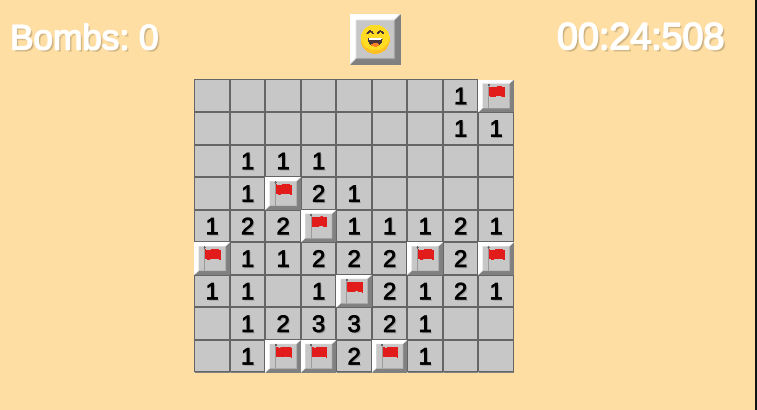

# 💣 Minesweeper-AltTester

使用 Unity 製作的經典踩地雷遊戲，並透過 AltTester 實現測試驅動開發（TDD），實作自動化 UI 測試，確保遊戲邏輯穩定與介面互動正常。

 <!-- 建議將圖片放在專案中，或使用線上連結 -->

---

## 🧪 測試流程

本專案採用 TDD 流程開發，測試內容包括：

- 地雷隨機生成規則驗證  
- 開啟格子與連鎖展開邏輯  
- 勝利與失敗條件確認  
- UI 響應與互動測試（AltTester）

🔗 **測試代碼**：[點我前往]([https://github.com/BrianGodd/Minesweeper-AltTester/blob/main/Assets/Tests/Minesweeper_Tests.cs](https://github.com/BrianGodd/Minesweeper-AltTester/tree/main/Assets/AltTester/Editor/Tests))

---

## 🎮 遊戲功能

- 左鍵：開啟格子  
- 右鍵：插上/移除旗子  
- 自動展開空白區域  
- 勝利與失敗提示音效與介面

🔗 **遊戲主控代碼**：[點我前往]([https://github.com/BrianGodd/Minesweeper-AltTester/blob/main/Assets/Game/BoardManager.cs](https://github.com/BrianGodd/Minesweeper-AltTester/tree/main/Assets/Scripts/Minesweeper))

---

## 🔗 Demo 連結

▶️ [點此觀看 Demo影片](https://youtu.be/47XGWXJwI7s)  

🕹️ [點此體驗 WebGL Demo](https://你的demo網址)  
（建議使用桌面版 Chrome 或 Edge 瀏覽器）
---

## ⚙️ 技術棧

- Unity 2022 或以上版本  
- C# 腳本撰寫 Game code & Test code 
- AltTester SDK 進行 邏輯驗證、系統測試 與 UI 測試 等  

---

## 🏁 快速開始

```bash
# 複製專案
git clone https://github.com/BrianGodd/Minesweeper-AltTester.git

# 在 Unity 中開啟此資料夾

# 執行測試（AltTester）
AltTester Editor > Run in Editor > Run selected Tests

# 或直接 Play 遊戲場景
